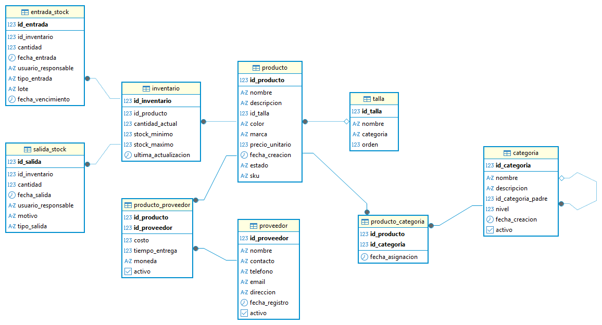

# DAW_Gestor_Inventario_Tienda_de_modas
Implementacion de un sistema de gestion de inventario (Producto de venta) orientado hacia empresas o emprendimientos en el rubro de la moda 

## Integrantes:

- Andrea Isabel Chávez Mejía CM24080
- Ana Cristina Martinez Salas - MS24088 
- Jose Israel Lemus Salguero LS24009
- Rolando Estuardo Salguero Borja SB21023
- Joel Isaac Chavez Arevalo CA24016

##  Requisitos previos

Antes de ejecutar el proyecto, asegúrate de tener instalado:

- [Java JDK 17+](https://www.oracle.com/java/technologies/javase/jdk17-archive-downloads.html)  
- [Maven](https://maven.apache.org/)  
- [PostgreSQL](https://www.postgresql.org/download/) y [pgAdmin](https://www.pgadmin.org/download/)  
- [Git](https://git-scm.com/downloads)  
- Navegador web para acceder a la API y documentación  

Opcional:
- IDE recomendado: Visual Studio Code, IntelliJ IDEA o Eclipse  

## Estructura del Repositorio
- **`backend/`** → Código Java con Entities, Repositories, Services y DTOs.  
- **`database/`** → Scripts SQL, schema de PostgreSQL y datos de prueba.  
- **`frontend/`** → Carpeta para la interfaz gráfica y recursos web.  
- **`media/`** → Diagramas y documentación (incluye el modelo ERD).  
- **`README.md`** → Documentación principal del proyecto.

## Modelo ERD - DB:

## Tecnologías Utilizadas
- **Lenguaje:** Java (Spring Boot, JPA/Hibernate)  
- **Base de Datos:** PostgreSQL + pgAdmin  
- **Documentación:** Swagger/OpenAPI   
- **Control de versiones:** GitHub 

