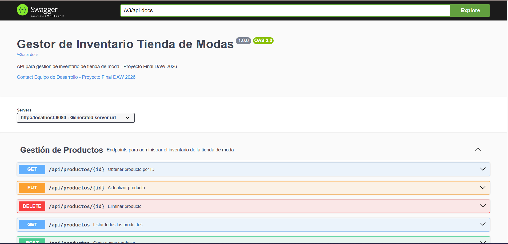

# DAW_Gestor_Inventario_Tienda_de_modas
Implementacion de un sistema de gestion de inventario (Producto de venta) orientado hacia empresas o emprendimientos en el rubro de la moda 

## Integrantes:

- Andrea Isabel Chávez Mejía CM24080
- Ana Cristina Martinez Salas - MS24088 
- Jose Israel Lemus Salguero LS24009
- Rolando Estuardo Salguero Borja SB21023
- Joel Isaac Chavez Arevalo CA24016

##  Requisitos previos

### Método Recomendado (Docker):
- [Docker Desktop 4.0+](https://www.docker.com/products/docker-desktop/) (incluye Docker Engine y Docker Compose)
- Navegador web para acceder a la aplicación y documentación

### Método Manual (Desarrollo):
- [Java JDK 21+](https://www.oracle.com/java/technologies/javase/jdk21-archive-downloads.html)  
- [Maven 3.8+](https://maven.apache.org/)  
- [Node.js 18+](https://nodejs.org/) y gestor de paquetes `pnpm` o `npm`
- [PostgreSQL](https://www.postgresql.org/download/) y [pgAdmin](https://www.pgadmin.org/download/)  
- [Git](https://git-scm.com/downloads)  
- IDE recomendado: Visual Studio Code, IntelliJ IDEA o Eclipse  


## Estructura del Repositorio
- **`backend/`** → Código Java con Entities, Repositories, Services y DTOs.  
- **`database/`** → Scripts SQL, schema de PostgreSQL y datos de prueba.  
- **`frontend/`** → Carpeta para la interfaz gráfica y recursos web.  
- **`media/`** → Diagramas y documentación (incluye el modelo ERD).  
- **`README.md`** → Documentación principal del proyecto.

## Modelo ERD - DB:


## Tecnologías Utilizadas
- **Backend:** Java (Spring Boot, JPA/Hibernate)  
- **Frontend:** React + Vite, Javascript, CSS Vanilla  
- **Base de Datos:** PostgreSQL + pgAdmin  
- **Documentación:** Swagger/OpenAPI   
- **Control de versiones:** Git & GitHub

# 💻 Guía de Inicialización del Proyecto

El proyecto se puede inicializar e integrar de forma rápida y automatizada utilizando **Docker** (método recomendado para validación y pruebas integradas) o de forma manual para cada módulo.

---

# 🐳 Inicialización Integrada con Docker (Recomendado)

Este método automatiza la descarga de imágenes, la compilación de código, la configuración de la base de datos (con su esquema y datos de prueba) y la comunicación de red interna entre los contenedores.

### 1. Iniciar el Stack Completo
Ejecuta el siguiente comando en la raíz del proyecto para compilar e iniciar los servicios en segundo plano:

```bash
docker compose up -d --build
```
* *Nota:* El flag `--build` asegura que se construyan imágenes limpias a partir de las fuentes locales actuales y el flag `-d` libera tu consola.

### 2. Verificar Estado de los Servicios
Puedes verificar que los contenedores estén activos y en estado **Up** mediante:

```bash
docker compose ps
```

Deberás ver los tres servicios corriendo en los puertos mapeados del host:
*   **`fashiontrack_frontend`** (puerto `80`)
*   **`fashiontrack_backend`** (puerto `8080`)
*   **`fashiontrack_db`** (puerto `5432`)

### 3. Acceso a la Aplicación
Una vez inicializado el stack, puedes ingresar desde el navegador web de la máquina host a:
*   **Frontend (Aplicación React):** [http://localhost](http://localhost)
*   **Swagger UI (API Docs):** [http://localhost:8080/swagger-ui/index.html](http://localhost:8080/swagger-ui/index.html)

### 4. Apagar los Servicios
Para detener y retirar los contenedores y redes virtuales del stack manteniendo intactos los datos de la base de datos (gracias al volumen configurado):

```bash
docker compose down
```

---

# 🛠️ Inicialización Manual para Desarrollo Local

Si prefieres ejecutar los módulos por separado de forma local en tu máquina host, sigue estas instrucciones:

# 🖥️ Inicializar el Frontend

La interfaz de usuario está construida con React y utiliza **pnpm** para una gestión de dependencias rápida y eficiente.

El frontend está completamente integrado con la API REST del backend en Spring Boot y la base de datos PostgreSQL, realizando operaciones reales en tiempo real sin almacenamiento o datos de prueba simulados.

## 📋 Requisitos Previos

- Node.js
- pnpm

## ▶️ Pasos de Ejecución

### 1. Abrir la terminal

### 2. Navegar al directorio del frontend

```bash
cd frontend
```

### 3. Instalar dependencias

```bash
pnpm install
```

### 4. Iniciar el servidor de desarrollo

```bash
pnpm run dev
```

### 5. Abrir la aplicación en el navegador

Dirígete a la URL indicada en la terminal, normalmente:

```txt
http://localhost:5173/
```

---

# ⚙️ Inicializar el Backend

El backend está desarrollado en Spring Boot y expone los endpoints necesarios para la gestión del inventario.

## 📋 Requisitos Previos

- Java 17 o superior
- PostgreSQL configurado localmente

## ▶️ Pasos de Ejecución

### 1. Abrir una nueva terminal

### 2. Navegar al directorio del backend

```bash
cd backend/Inventario/inventario
```

### 3. Ejecutar la aplicación

#### Linux / macOS

```bash
./mvnw spring-boot:run
```

#### Windows

```cmd
mvnw.cmd spring-boot:run
```

---

## 📚 Documentación de la API con Swagger

El backend está documentado utilizando **Swagger (OpenAPI 3.0)**, lo que permite visualizar y probar todos los endpoints de forma interactiva.

### Acceso a la Documentación

Una vez iniciado el backend, accede a:

```txt
http://localhost:8080/swagger-ui/index.html
```
> El puerto puede variar dependiendo de la configuración definida en `application.properties`.


### Evidencias de la Documentación

#### Vista General de la API



#### Detalle de Endpoint - Obtener Producto


#### Estructura de Datos - Crear Producto


## 📋 Tabla de Endpoints - API REST

**Base URL:** `http://localhost:8080`  
**Documentación interactiva:** `http://localhost:8080/swagger-ui/index.html`

### Gestión de Productos

| Método | Endpoint | Descripción | Código de Respuesta |
|--------|----------|-------------|---------------------|
| GET | `/api/productos` | Listar todos los productos | 200 OK |
| GET | `/api/productos/{id}` | Obtener producto por ID | 200 OK / 404 Not Found |
| POST | `/api/productos` | Crear nuevo producto | 201 Created |
| PUT | `/api/productos/{id}` | Actualizar producto existente | 200 OK |
| DELETE | `/api/productos/{id}` | Eliminar producto del inventario | 204 No Content |

> **Nota:** Todos los endpoints utilizan el formato JSON para el intercambio de datos.

---

# 📌 Estado del Proyecto e Integración Completa

El proyecto ha completado exitosamente su etapa de desarrollo, pruebas e integración de extremo a extremo (End-to-End). Se han eliminado todos los archivos y referencias de datos simulados (*Mock Data*), logrando que todos los módulos realicen consultas y operaciones directas sobre el servidor Spring Boot y la base de datos PostgreSQL.

## 📊 Matriz de Estado de Módulos

| Módulo | Características Principales | Estado | Base de Datos |
| :--- | :--- | :--- | :--- |
| **🏠 Dashboard** | Resumen cuantitativo de existencias, productos críticos con stock bajo y gráfica dinámica de distribución de inventario por categoría. | **Completado** | PostgreSQL (Real-time) |
| **📦 Inventario** | Listado interactivo, búsqueda por Nombre/SKU, filtros avanzados por categoría (padre/hijo), creación/edición de productos con selección jerárquica y validación con feedback visual. | **Completado** | PostgreSQL (Real-time) |
| **🏷️ Categorías** | Gestión de jerarquías (categorías padre y subcategorías hija), control de productos asociados e integración con el catálogo. | **Completado** | PostgreSQL (Real-time) |
| **🤝 Proveedores** | Listado de contactos, formularios de registro/edición con feedback visual de escritura, y botones interactivos de un clic para copiar correo y celular. | **Completado** | PostgreSQL (Real-time) |
| **📈 Reportes** | Panel detallado de rendimiento de inventario y alertas visuales automáticas para productos con necesidad de reabastecimiento. | **Completado** | PostgreSQL (Real-time) |

---

## 🛠️ Detalles de Integración y Funcionalidad

### ✅ Operaciones CRUD Reales (PostgreSQL)
* **Visualización (GET):** Carga dinámica de tablas y paneles estadísticos. Los filtros jerárquicos de categorías y búsquedas de texto plano se resuelven en tiempo real contra los registros de la base de datos.
* **Creación (POST):** Validación interactiva de campos de texto y numéricos. Permite la asociación en base de datos de productos a sus respectivas categorías padres/hijas.
* **Edición (PUT):** Actualización inmediata de registros (proveedores, productos y categorías) reflejándose inmediatamente en toda la SPA.
* **Eliminación (DELETE):** Eliminación transaccional con alertas y confirmaciones modales, validando la integridad referencial y las dependencias de tablas (ej. inventario y relaciones producto-categoría).

### 📱 Diseño Mobile-First & Ajustes de Usabilidad
* **Menú Lateral Adaptativo:** Oculto por defecto en pantallas de celulares y tabletas (`<= 768px`) para aprovechar al máximo el espacio de la interfaz. Su apertura se realiza a través de un botón flotante hamburguesa, optimizado y más compacto.
* **Ocultamiento de Columnas Secundarias:** En pantallas móviles, las tablas ocultan de manera automática campos secundarios (como ID, SKU o descripciones extensas). La información completa se puede consultar de forma clara y formateada en el **Modal de Detalles** (`👁️`).
* **Formularios Responsivos:** Los formularios se apilan verticalmente de forma automática en pantallas pequeñas para optimizar el teclado digital y el uso táctil.
* **Feedback de Escritura (Modo Oscuro):** Se mejoraron las hojas de estilo (`CSS`) de todos los formularios para asegurar la perfecta visibilidad del texto ingresado por el usuario, evitando textos invisibles por temas oscuros del navegador.


